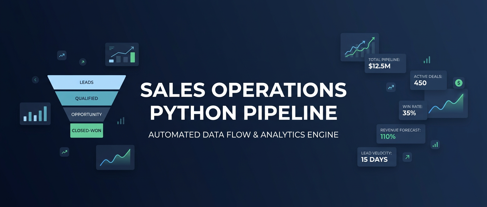
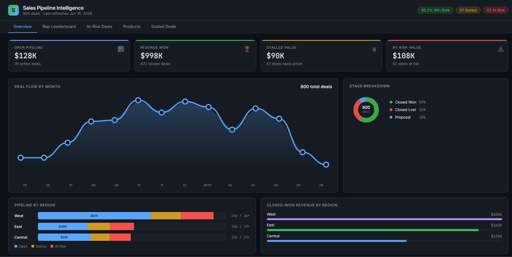
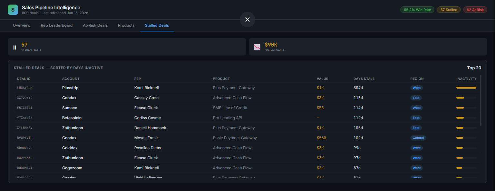
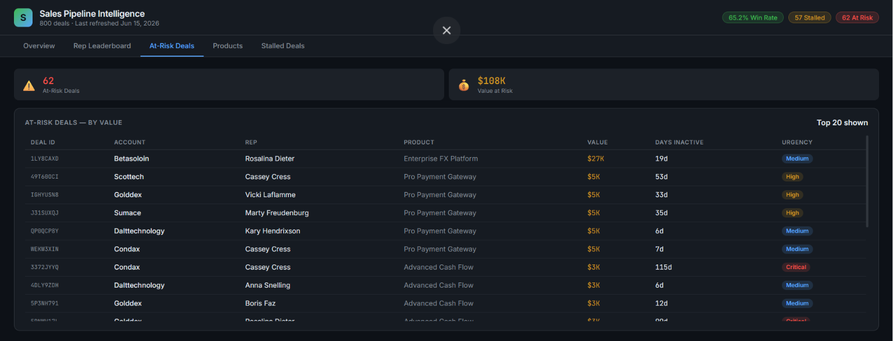
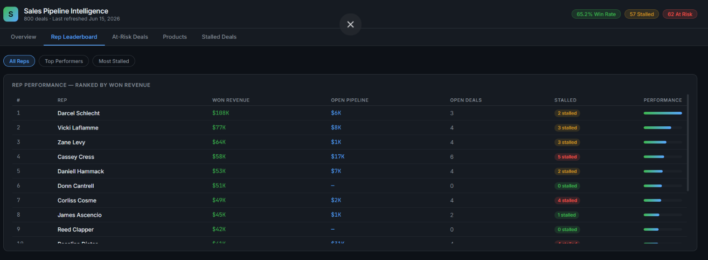

  

      

Overview
End-to-end sales operations pipeline for SME fintech. Automates data ingestion, SQL analytics, Excel reporting, and Slack alerting — with zero manual intervention.

Quick Start
Bash

pip install -r requirements.txt
python run.py --run-once      # run once
python run.py --schedule      # daily scheduler (08:00)
Pipeline
text

CRM Dataset → Clean & Transform → SQLite → SQL Analytics
                                      ├── Stalled Deals (7+ days inactive)
                                      ├── At-Risk Accounts (proposal stage)
                                      └── Rep Performance
                                 ┌─────┴─────┐
                          Excel Report     Slack Alert / JSON draft
                                 └─────┬─────┘
                               Power BI CSV Export
Output
File	Description
outputs/daily_ops_report.xlsx	6-sheet Excel report
outputs/sales_ops.db	SQLite — deals, activity_logs, v_deal_health
outputs/powerbi_dataset.csv	Power BI export with is_stalled / is_at_risk flags
outputs/alerts/slack_alert_*.json	Local alert draft (when webhook not set)
Screenshots
Overview	Stalled	At-Risk	Reps
			
Configuration
Bash

cp .env.example .env
Variable	Default	Description
SLACK_WEBHOOK_URL	—	Slack incoming webhook
SLACK_ENABLED	false	Enable Slack alerts
STALLED_DAYS	7	Inactivity threshold (days)
AT_RISK_DAYS	5	At-risk inactivity threshold
SCHEDULE_TIME	08:00	Daily run time
Structure
text

src/
  config.py    # env config + domain maps
  data.py      # download · clean · transform · synthesize
  db.py        # SQLite wrapper
  analytics.py # SQL detection logic
  reports.py   # Excel report builder
  alerts.py    # Slack webhook + local fallback
  scheduler.py # daily scheduler

tests/
  test_pipeline.py   # pytest checks
Test
Bash

python -m pytest tests/ -v
MIT License · EvilSnIzer
